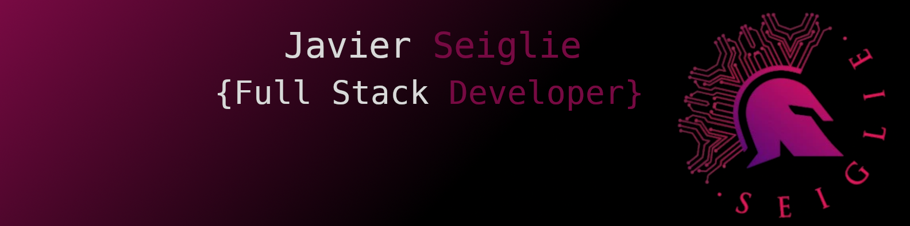

## Hi there 👋
<!-- 

   
   <h3 align="center">¡Hola 👋! Javier por acá 👨🏻‍💻</h3>
<!-- 
 -->
 

   
   
   

<!--
**jseiglie/jseiglie** is a ✨ _special_ ✨ repository because its `README.md` (this file) appears on your GitHub profile.

Here are some ideas to get you started:

- 🔭 I’m currently working on ...
- 🌱 I’m currently learning ...
- 👯 I’m looking to collaborate on ...
- 🤔 I’m looking for help with ...
- 💬 Ask me about ...
- 📫 How to reach me: ...
- 😄 Pronouns: ...
- ⚡ Fun fact: ...
-->
